# CaseAutoFramework-Web  向下翻有演示截图

## 后端传送门
[CaseAutoFramework](https://github.com/nightfall-w/CaseAutoFramework)

## 安装相关依赖包
```
npm install
```

### 开发环境的编译与运行
```
npm run serve
```

### 生产环境编译构建
```
npm run build
```

### Lints and fixes files
```
npm run lint
```
### 演示截图
##### 创建项目
 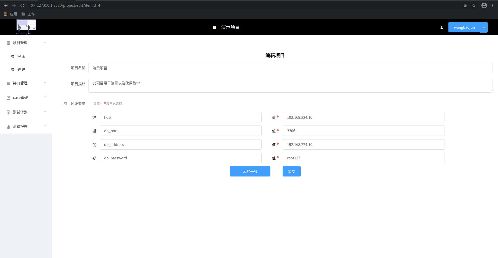
##### 切换项目
 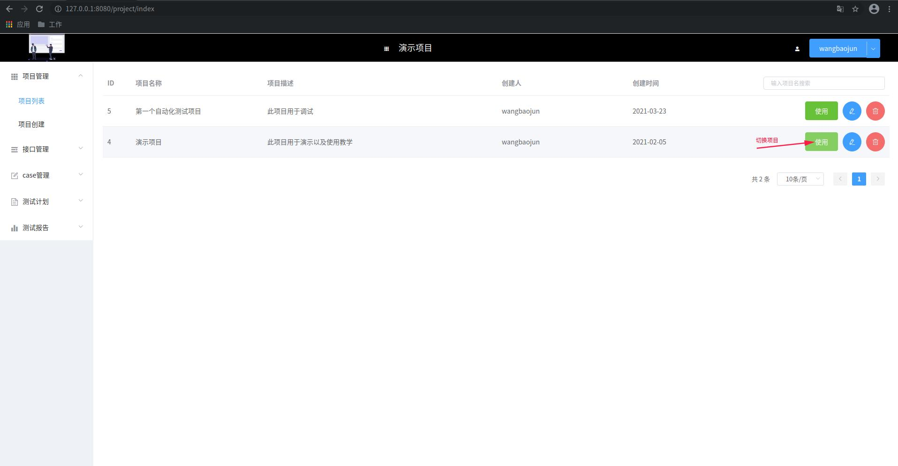
##### 接口测试-录入接口（DDT）
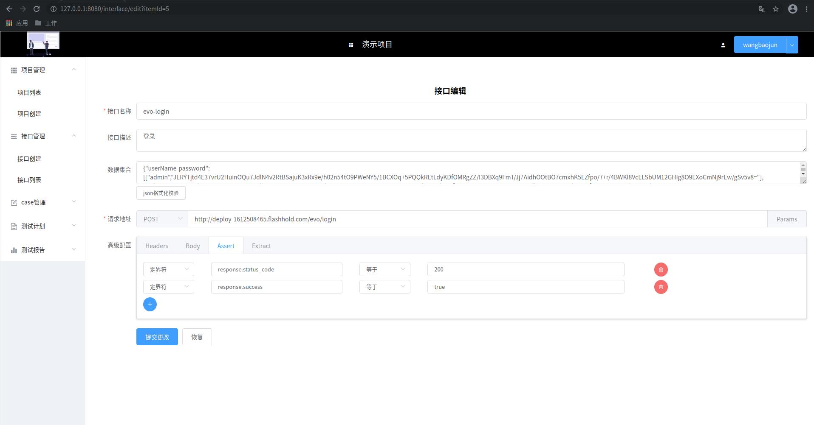
##### 接口测试-录入接口-提交参数
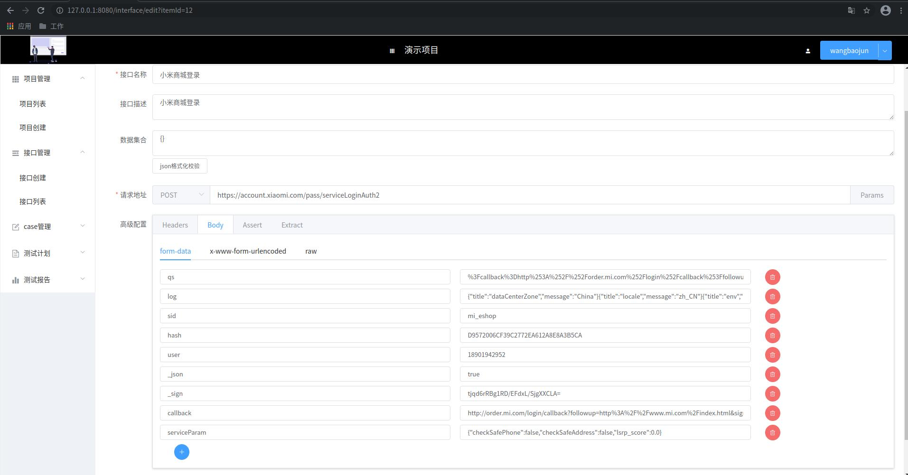
##### 接口测试-接口列表
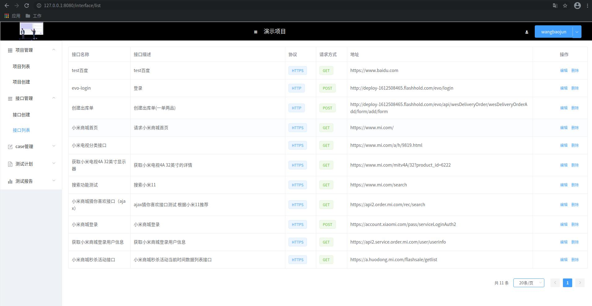
##### 创建接口测试计划
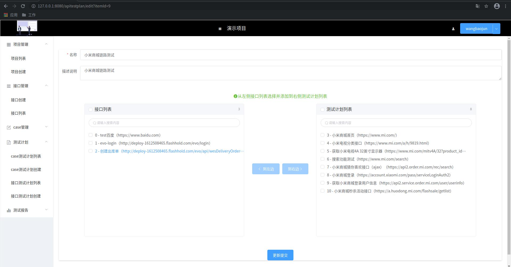
##### 接口测试-计划列表
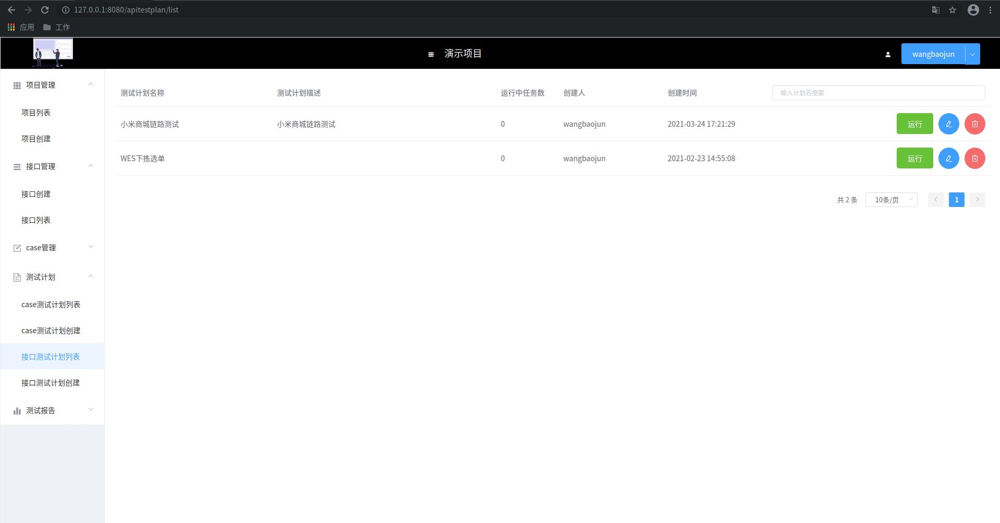
##### 接口测试-测试计划-任务列表
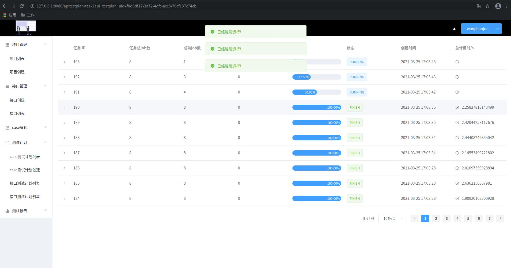
##### 接口测试-测试计划-任务执行结果查看
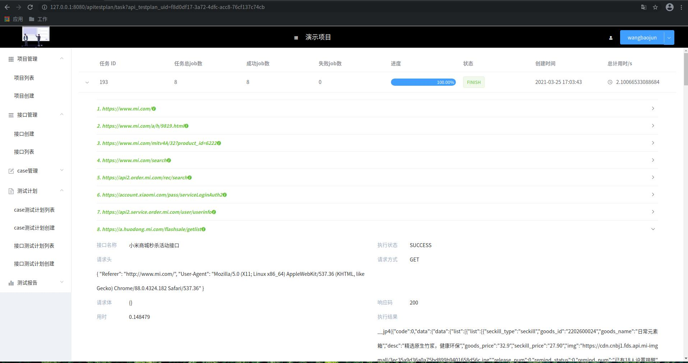
##### case脚本测试-创建case测试计划-同步gitlab case
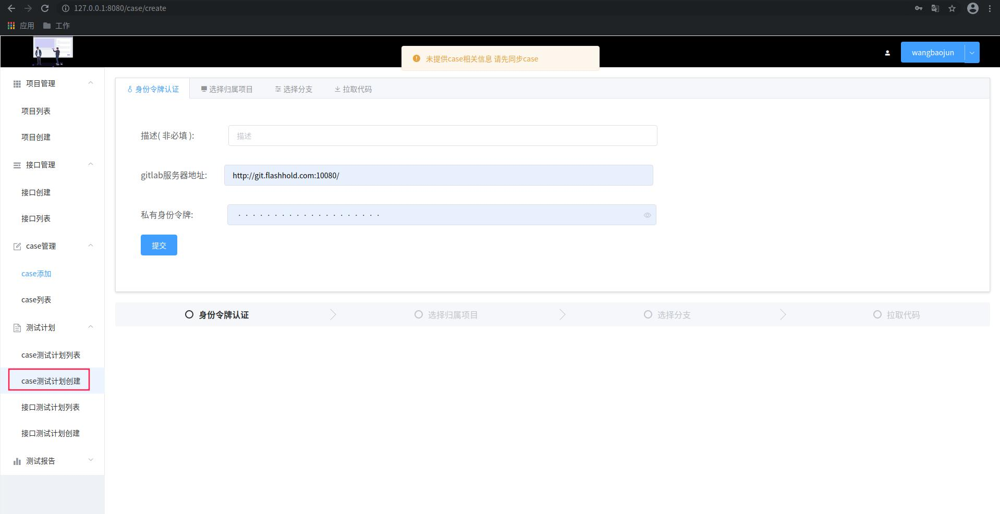
##### case脚本测试-创建case测试计划-选择case所在gitlab代码库
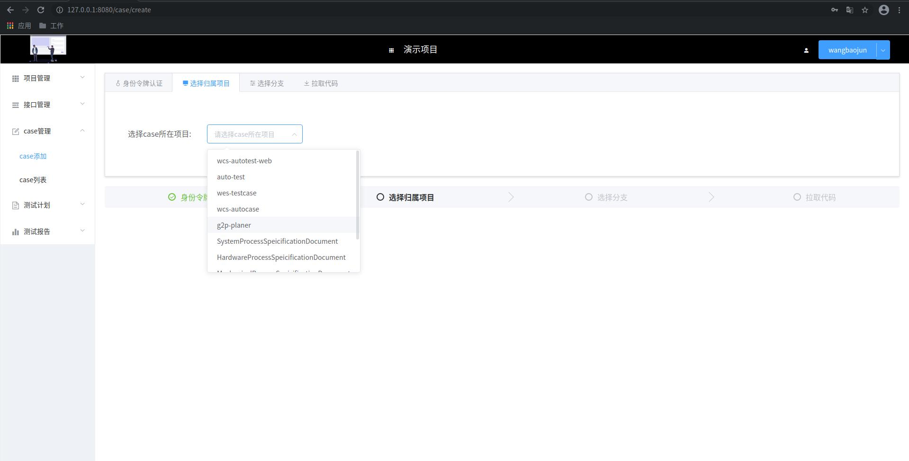
##### case脚本测试-创建case测试计划-选择case所在分支
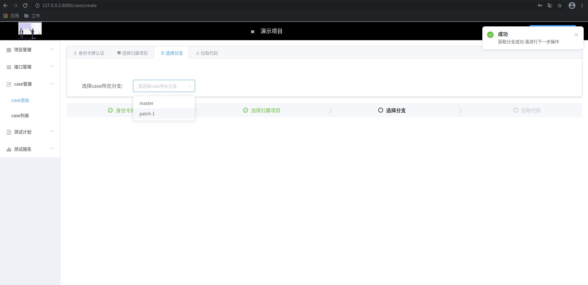
##### case脚本测试-创建case测试计划-同步代码
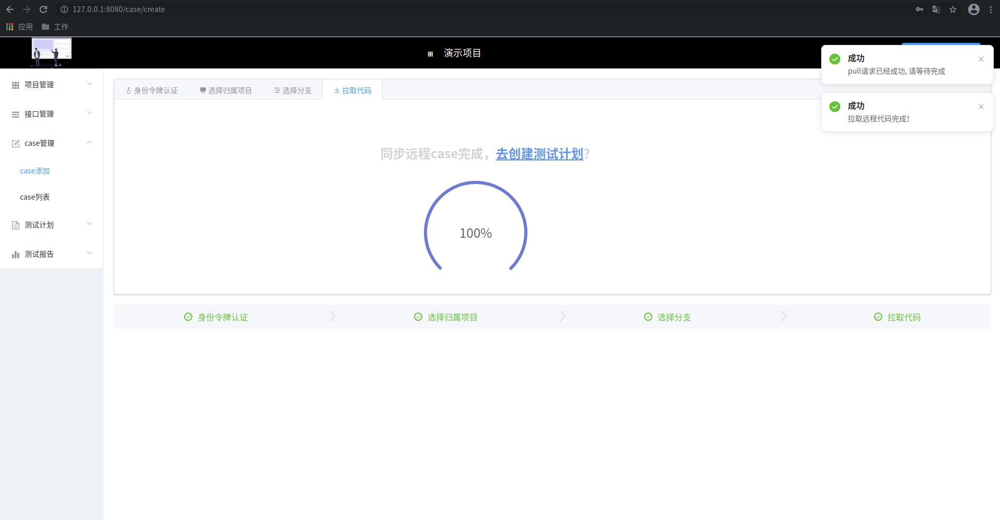
##### case脚本测试-创建case测试计划-组成测试计划
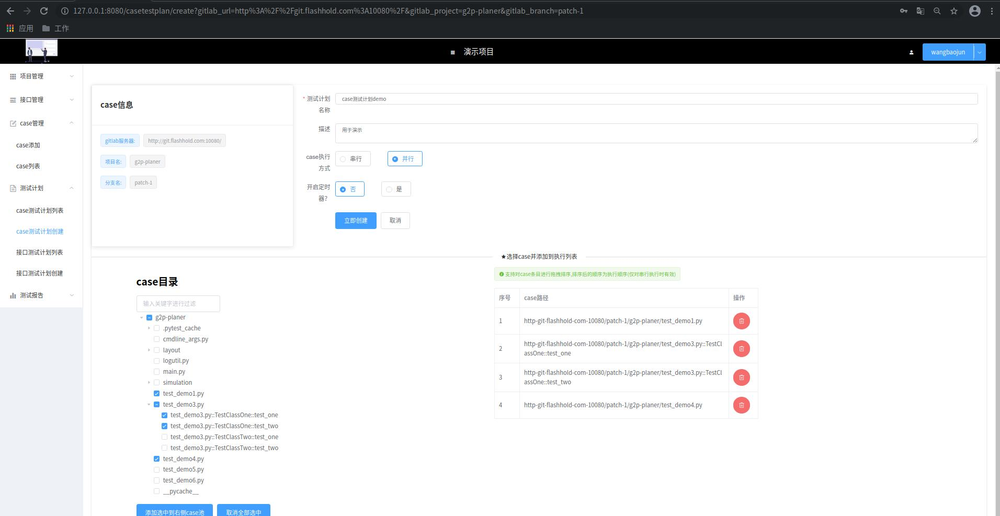
##### case脚本测试-创建cese测试计划-添加定时器
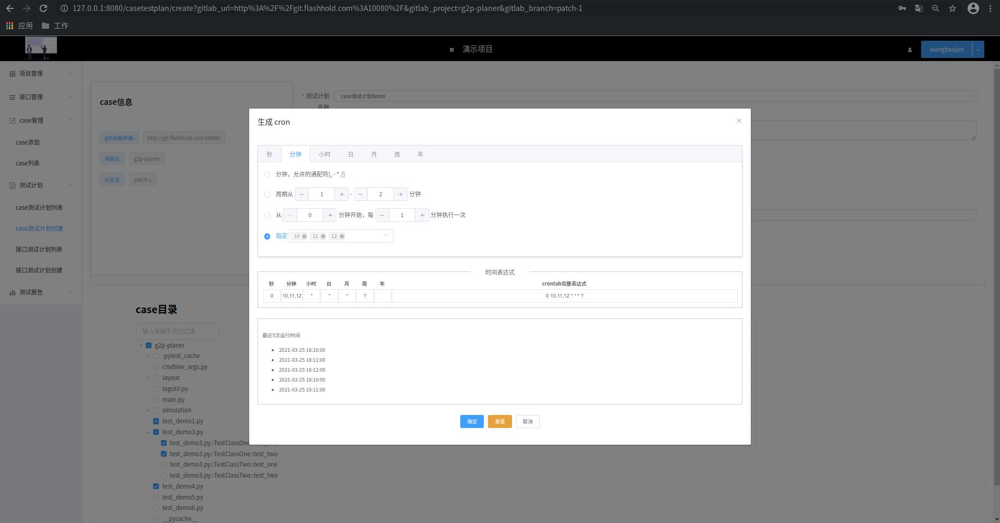
##### case脚本测试-测试计划列表
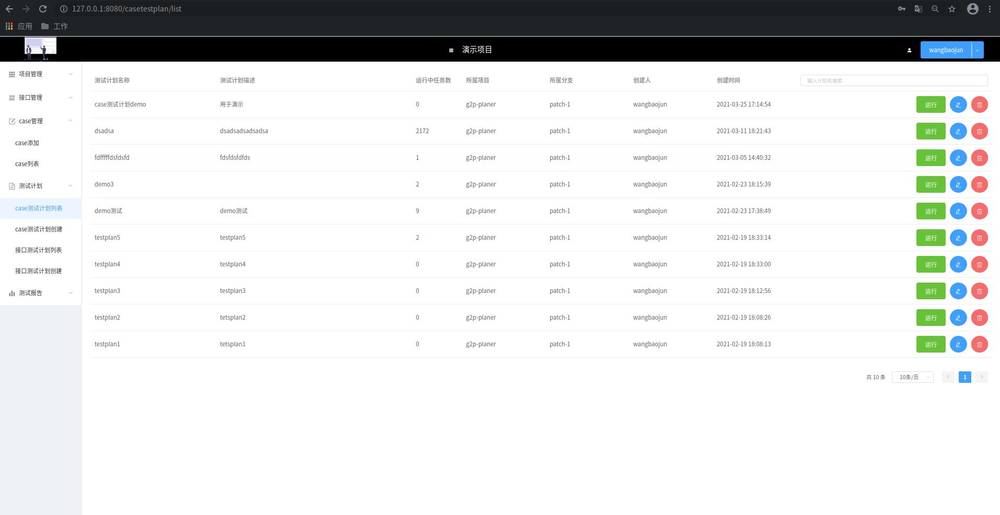
##### case脚本测试-测试计划列表-任务列表
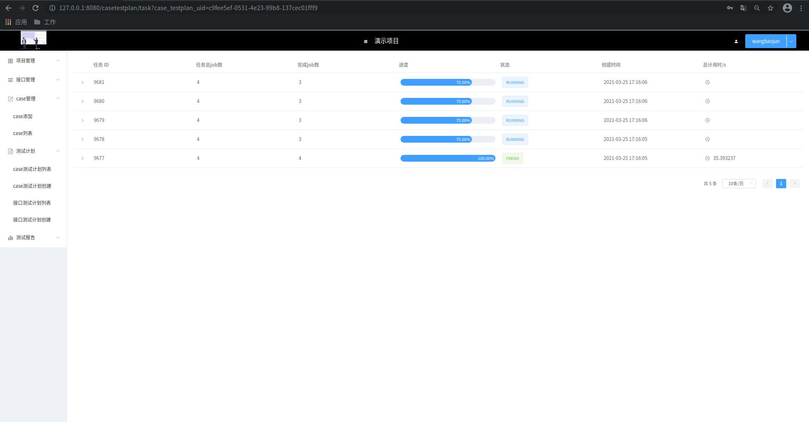
##### case脚本测试-测试计划列表-任务执行结果
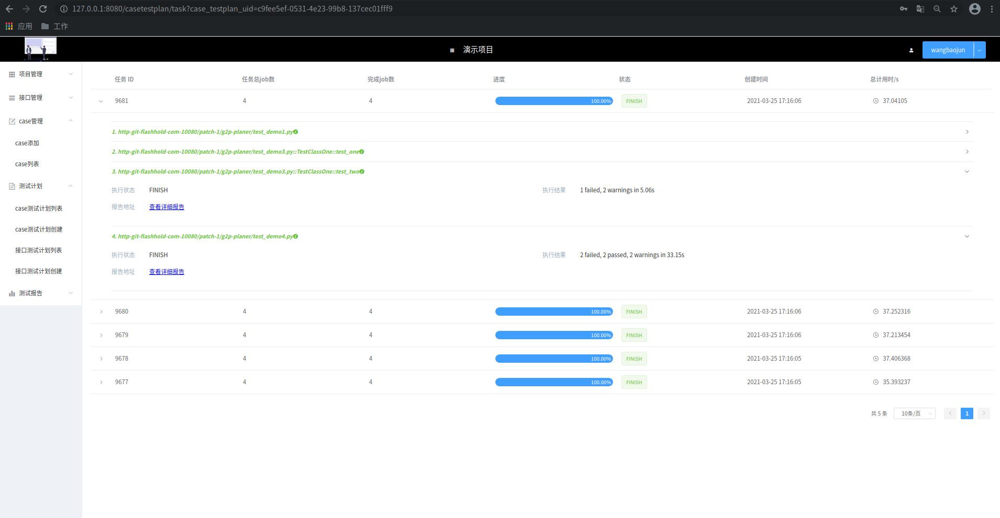
##### case脚本测试-测试计划列表-任务执行结果详情
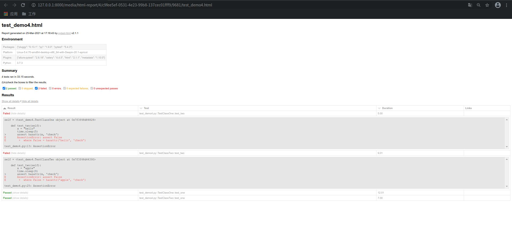
